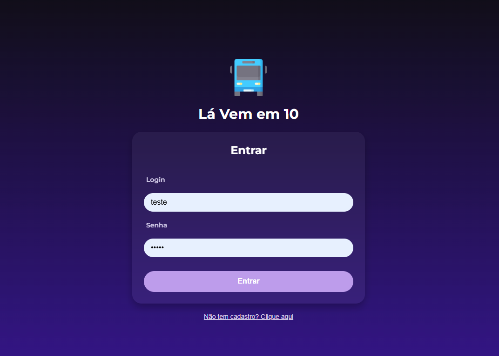
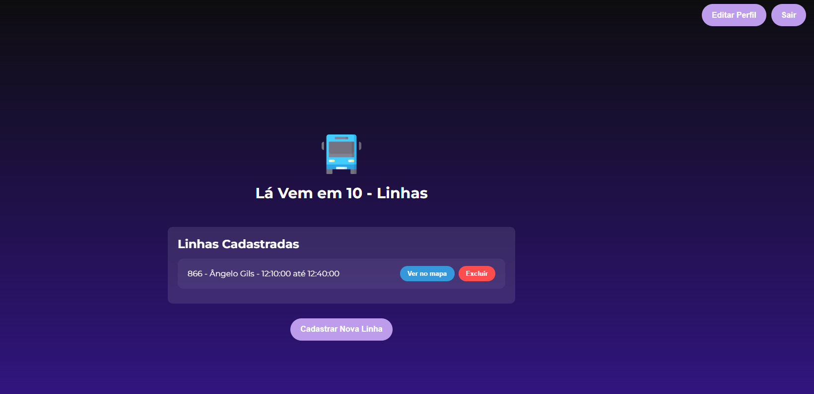
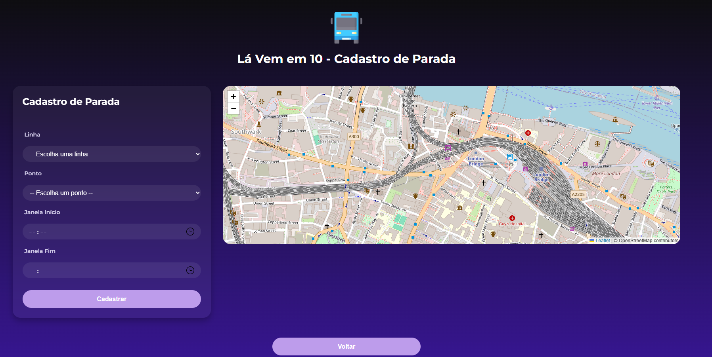
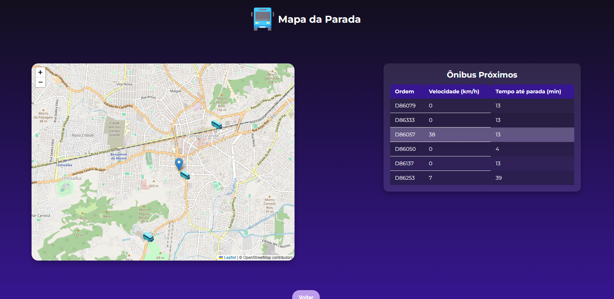
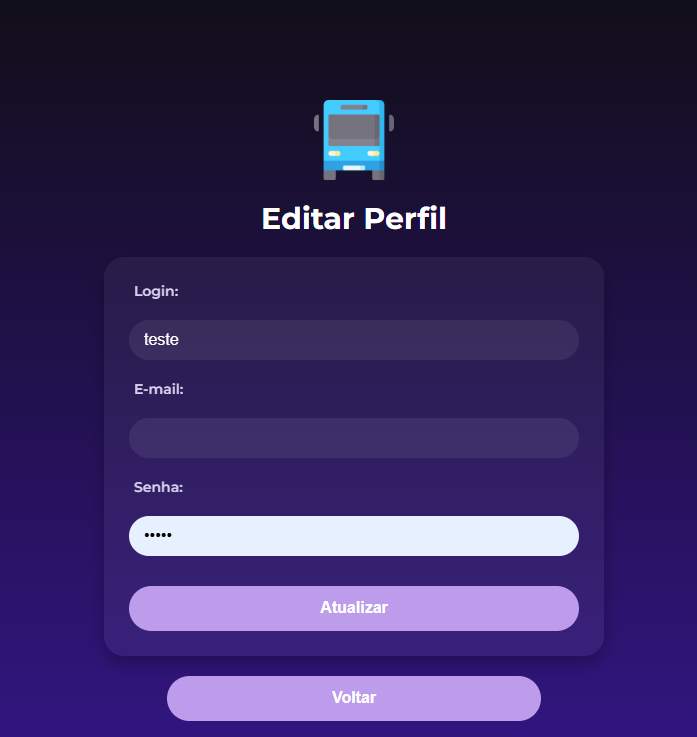

# Lá Vem em 10 - Sistema de Acompanhamento de Ônibus

## Descrição

O projeto "Lá Vem em 10" é um sistema de monitoramento de ônibus em tempo real, desenvolvido utilizando APIs de ônibus do Rio de Janeiro. Ele permite aos usuários cadastrarem suas paradas de ônibus e receberem notificações sobre os horários de chegada dos ônibus em tempo real. O sistema exibe a localização dos ônibus no mapa e mostra uma tabela com detalhes sobre os ônibus próximos à parada selecionada.

### Funcionalidades:
- Cadastro e autenticação de usuários.
- Cadastro de paradas de ônibus, incluindo a linha, o ponto e a janela de horário.
- Visualização de ônibus em tempo real em um mapa, com a exibição da velocidade e o tempo até a parada.
- Notificações via e-mail quando um ônibus da linha cadastrada estiver a 10 minutos de chegar ao ponto de parada.

## Tecnologias Utilizadas

### Backend
- **FastAPI**: Framework web para o desenvolvimento da API.
- **SQLAlchemy**: ORM para manipulação do banco de dados.
- **Celery**: Sistema de tarefas assíncronas, utilizado para o cálculo periódico da localização dos ônibus.
- **Redis**: Broker de mensagens utilizado pelo Celery.
- **PostgreSQL**: Banco de dados relacional utilizado para armazenar as informações do sistema.
- **Docker**: Utilizado para dockerizar os serviços e facilitar o deploy.

### Frontend
- **React**: Biblioteca JavaScript para a construção da interface de usuário.
- **React Router**: Gerenciamento de rotas no frontend.
- **Leaflet**: Biblioteca para visualização de mapas interativos.
- **Axios**: Cliente HTTP utilizado para comunicação com a API.
- **React Toastify**: Biblioteca para exibição de notificações.

### Serviços Externos
- **TravelTime API**: API utilizada para calcular onde é possível chegar em 10 minutos a partir de um ponto de origem.
  
- **Mobilidade Rio - Dados GPS de Ônibus (SPPO)**
   - **Endpoint de exemplo**: `https://dados.mobilidade.rio/gps/sppo?dataInicial=2025-04-08+10:01:11&dataFinal=2025-04-08+10:03:11`
   - **Descrição**: Fornece dados de GPS de ônibus no Rio de Janeiro, com informações como a localização atual dos ônibus e o horário de coleta.
   - **Uso**: A API é utilizada para obter as posições atualizadas dos ônibus a partir da plataforma de dados da Secretaria Municipal de Transportes (SMTR) do Rio de Janeiro.

- **Mobilidade Rio - GTFS (Informações das Linhas de Ônibus)**
   - **Endpoint de exemplo**: `https://api.mobilidade.rio/gtfs/routes/?route_short_name=866`
   - **Descrição**: Retorna informações sobre a linha de ônibus especificada, como o nome da linha e outras características.
   - **Uso**: Utilizada para recuperar informações detalhadas sobre as linhas de ônibus para serem associadas ao sistema.

## Como Rodar o Projeto

1. Certifique-se de que o Docker e o Docker Compose estão instalados em sua máquina.
2. Configure no arquivo .envExemple os seguintes parametros:
  - DATABASE_URL= url do banco de dados que irá usar  
  - REMETENTE= email que será o remetente do sistema
  - SENHA_EMAIL= senha de app do email que pode ser adquirida atráves de [Fazer login com senhas de app](https://support.google.com/accounts/answer/185833?hl=pt-BR&authuser=3)
  - X_APPLICATION_ID= id de aplicação do TravelTime que pode ser adquirido em [Traveltime](https://account.traveltime.com/)
  - X_API_KEY= chave de api da TravelTime que é adquirida junto com o item anterior

3. Execute o seguinte comando para rodar o ambiente:
   ```bash
   docker-compose up

## Obs:
  O aplicativo possui poucos testes, mas caso queira roda-los execute o comando:
   ```bash
   docker-compose run --rm test
   ```


### Configuração do Banco de Dados
O banco de dados é configurado automaticamente com o uso do Docker Compose. Não é necessário configurar manualmente, a não ser que você deseje personalizar as variáveis de ambiente.

## Como Usar
1. **Cadastro de Usuário**: No início, os usuários podem criar uma conta com login, e-mail e senha.
2. **Login**: Após o cadastro, os usuários podem fazer login utilizando as credenciais criadas.
3. **Cadastro de Parada**: Após o login, o usuário pode cadastrar uma parada de ônibus, incluindo o nome da linha, o ponto e a janela de horário.
4. **Visualização de Ônibus**: O sistema irá exibir a localização dos ônibus em tempo real, com detalhes como a velocidade e o tempo estimado até a chegada ao ponto.
5. **Notificações**: O sistema enviará notificações por e-mail quando um ônibus da linha cadastrada estiver a 10 minutos de distância da parada.

## Fluxo de Navegação
- **Login**: Página inicial onde o usuário faz login.
- **Cadastro**: Página para novos usuários se cadastrarem.
- **Minhas Linhas**: Página onde o usuário pode visualizar suas paradas cadastradas.
- **Cadastrar Linha**: Página para cadastrar novas linhas de ônibus.
- **Editar Perfil**: Página para atualizar as informações do usuário.

## Funcionalidades de Acesso Privado
Certas páginas, como a de **Minhas Linhas**, **Cadastrar Linha** e **Editar Perfil**, estão protegidas e exigem que o usuário esteja autenticado. Isso é gerido através do contexto de autenticação (`AuthContext`).

## API

### Endpoints Principais
- **POST /usuarios/criar**: Cria um novo usuário.
- **POST /usuarios/login**: Realiza o login do usuário.
- **PUT /usuarios/{usuario_id}**: Atualiza os dados do usuário.
- **GET /onibus/dados_onibus/{linha}**: Retorna os dados dos ônibus em tempo real para uma linha específica.
- **GET /paradas**: Retorna todas as paradas cadastradas, util para testes.
- **POST /paradas**: Cria uma nova parada.


## OBS
1. No arquivo main.py do backend possui uma função comentada que iniciará logo quando subir o sistema, essa função serve para pegar todos os pontos dos ônibus disponibilizados
pela api da Mobilidade Rio, como a api possui uma certa lentidão foi um modo que consegui trazer os pontos sem o usuário esperar por tempos muito longos, no arquivo 
**backend/app/usuarios.db** já possui todos os pontos cadastrados até o dia 28/04/2025.

2. No arquivo **backend/app/task.py** possui uma tarefa **atualizar_linhas_onibus** que de hora em hora atualiza os onibus do Rio de Janeiro através da Mobilidade Rio

3. Para configurar a frequência das tarefas e quais delas são chamadas, modifique o arquivo **backend/app/celery_worker.py**


## Imagens do Projeto







